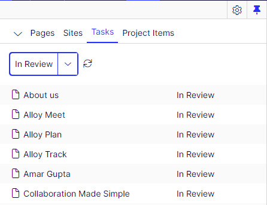
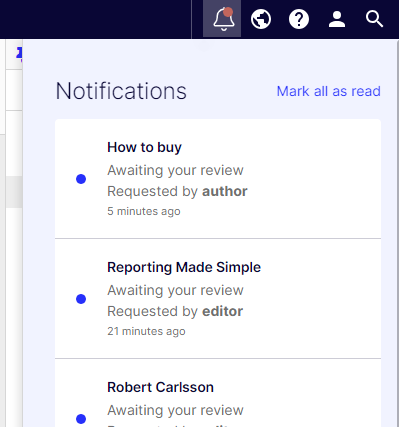
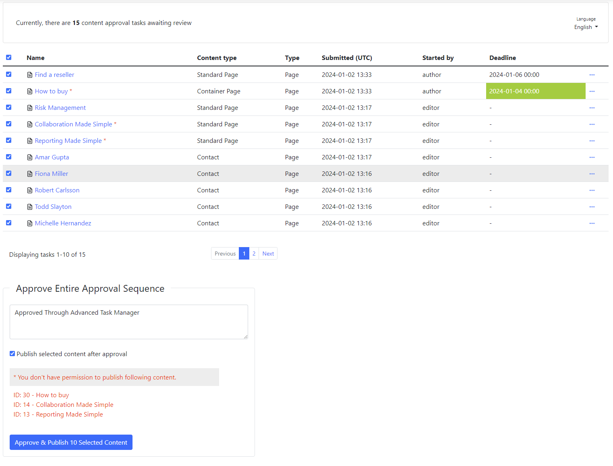
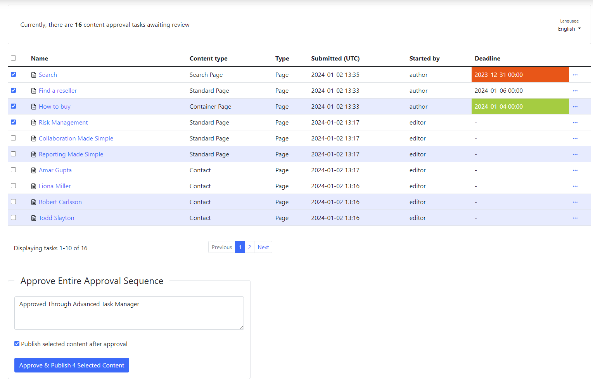
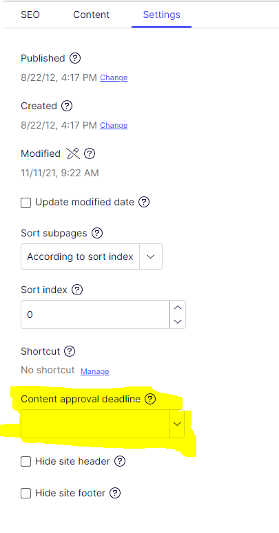
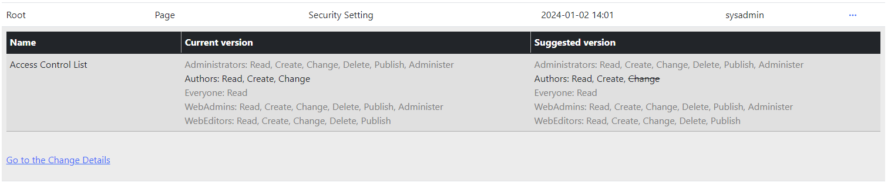

# Advanced Task Manager for Optimizely

The **Advanced Task Manager for Optimizely** is a freely available module. If you find it beneficial, you can show your support by treating me to a coffee on [Ko-fi](https://ko-fi.com/U7U2STV29):

[](https://ko-fi.com/U7U2STV29)

## Description
[](https://docs.microsoft.com/en-us/dotnet/)
[](http://world.episerver.com/cms/)
[](http://world.episerver.com/cms/)

The **Advanced Task Manager for Optimizely** provides CMS editors with enhanced oversight of administration tasks related to Awaiting Review in Content Approval and Change Approval processes.

## Features

- **Deadline Field:** Includes a deadline field for content approval.
- **User Notifications:** Sync user notifications associated with the task.
- **Approve entire approval sequence:** Allows approving the entire approval sequence in bulk or against individual tasks.
- **Publish content after approval:** Permits publishing content after approval in bulk or against individual tasks.
- **Change approval task information:** Facilitates changes to approval task information.

## Installation 

To install the Advanced Task Manager, begin by adding the NuGet package using [Optimizely NuGet](https://nuget.optimizely.com/):

`
dotnet add package AdvancedTaskManager
`

## Configuration

Add the AdvancedTaskManager handler in the `Startup.cs` within the `ConfigureServices` method. Here's an example with all available configurations:

```C#
public void ConfigureServices(IServiceCollection services)
{
    
    services.AddAdvancedTaskManager(o =>
    {
        o.DeleteChangeApprovalTasks = true; //Default true
        o.PageSize = 10; //Default 30
        o.AddContentApprovalDeadlineProperty = true; //Default false
        o.DeleteContentApprovalDeadlineProperty = true; //Default false
        o.WarningDays = 4; //Default 4;
        o.DateTimeFormat = "yyyy-MM-dd HH:mm"; //Default "yyyy-MM-dd HH:mm";
        o.DateTimeFormatUserFriendly = "MMM dd, yyyy, h:mm:ss tt"; //Default "MMM dd, yyyy, h:mm:ss tt";
    });

    OR

    services.AddAdvancedTaskManager();
    
...
}
```

In addition, the configuration can be read from the `appsettings.json`:

```Json
"AdvancedTaskManager": {
    "PageSize":  40, 
    "WarningDays": 6
}
```

The settings specified in the `appsettings.json` file will take precedence over any configurations defined in the Startup.


### Integrating Advanced Task Manager into the CMS

This solution incorporates an implementation of the `IMenuProvider`, guaranteeing the inclusion of the Advanced Task Manager administration pages in the CMS Admin menu titled `Adv. Task Manager.` No additional action is required, as Optimizely CMS will automatically scan and activate all instances of the `IMenuProvider`.

### Restricting Access to the Admin UI

By default, access to the Admin UI is limited to users with the `Administrators` role. The solution enhances this by granting access to the `Adv. Task Manager menu` for specific roles, including `CmsAdmins`, `Administrator`, `WebAdmins`, `WebEditors`, and `CMSEditors`. You have the flexibility to configure your authorization policy when registering the AdvancedTaskManager handler.

Example:

```C#
services.AddAdvancedTaskManager(o => { },
    policy =>
    {
        policy.RequireRole("MyRole");
    });
```

### Enabling Optimizely Opti ID Authentication

To integrate Optimizely Opti ID for authentication within your Optimizely CMS and other Optimizely One applications, it's necessary to define the `configurePolicy` for this module during your application startup. This involves a straightforward step of incorporating `policy.AddAuthenticationSchemes(OptimizelyIdentityDefaults.SchemeName);` into the `configurePolicy`, as illustrated in the example below.

```C#
services.AddAdvancedTaskManager(o => { },
    policy =>
    {
        policy.RequireRole("MyRole");
        policy.AddAuthenticationSchemes(OptimizelyIdentityDefaults.SchemeName);
    });
```

 ## Overview
Presently, the User notifications and Tasks (Awaiting Review) are disjointed, offering only fundamental information and limited control to the editors.






This project has two goals:

* **Empower editors:** Build a more versatile Approval Sequence tool for Content and Change Awaiting Review tasks, offering editors deeper insights.

* **Streamline approver workflow:** Combine user notifications with tasks within a single interface, allowing approvers to efficiently handle tasks individually or in bulk.

By default, Change Approval is integrated into the Approval Sequence in Optimizely CMS. Therefore, Advanced Task Manager seamlessly incorporates content approval tasks. If the [Change Approval](https://nuget.optimizely.com/package/?id=EPiServer.ChangeApproval) NuGet package is installed, the tool will automatically display two tabs in the left-side menu:

* Content Approval
* Change Approval


The tool furnishes the Editor with the following information regarding the task:

### Change Approval

* Name
* Content type
* Type
* Submitted (UTC)
* Started by
* Deadline (optional)

### Content Approval

* Name
* Content type
* Type
* Submitted (UTC)
* Started by

The list of current features are as follow:
* [Approve entire approval sequence](#approve-entire-approval-sequence-content-approval-only)
* [Publish content after approval](#publish-content-after-approval)
* [Deadline field for content approval](#deadline-field-for-content-approval-sequence-optional)
* [User Notifications Linked to the Task](#user-notifications-linked-to-the-task)
* [Information for Change Approval Tasks](#information-for-change-approval-tasks)
* [Task ordering](#task-ordering)

Some features are disabled by default, but you can decide which ones are enabled by Configuring option in the `startup.cs` or in `appsettings.json`.

### Approve Entire Approval Sequence (Content Approval Only)
The tool prompts the editor to approve the entire Content Approval Sequence for single or multiple contents. A comment in the comment field is mandatory..
 


 
### Publish Content After Approval

If the editor possesses publishing rights for content approval, the option to `Publish selected content after approval` will be enabled, allowing the editor to publish the content post-approval.

If the editor holds publishing rights for only some of the content after approving all, only the content the editor can publish will be processed. Warning messages will be displayed for content that the editor cannot publish.






### Deadline Field for Content Approval Sequence (Optional)


The deadline property is a date/time attribute enabling editors to assign priority to content (Page or Block). This prioritization ensures that Approvers are informed about the urgency before approval.

By default, the functionality of the deadline property is deactivated and can be activated (if needed) by incorporating the following option in `startup.cs` or in `appsettings.json`.

```C#
services.AddAdvancedTaskManager(o =>
{
    o.AddContentApprovalDeadlineProperty = true;
});
```

```Json
"AdvancedTaskManager": {
    "AddContentApprovalDeadlineProperty":  true
}
```

By enabling the `Content approval deadline` The property `Content approval deadline` will be added in all PageTyes and BlockTypes under `Settings` Tab.



The deadline property within the tool operates in three states:

* **Warning**

The `Warning `state, highlighted in green, alerts approvers to tasks requiring prompt attention for approval. By default, the Warning state spans a duration of 4 days. This implies that if the content deadline is within 4 days, the `deadline row`` will be highlighted in green.

To customize the duration of the `Warning` state, you can adjust the settings by Configuring option in the `startup.cs` or in `appsettings.json`.

```C#
services.AddAdvancedTaskManager(o =>
{
    o.WarningDays = 8;
});
```

```Json
"AdvancedTaskManager": {
    "WarningDays":  8
}
```

* **Danger**

The `Danger` state, highlighted in red, indicates that the deadline date/time has already passed.

* **Normal**

The `Normal` state is not associated with any specific color, signifying that there is still ample time for Approvers to prioritize the task.

If you set the `AddContentApprovalDeadlineProperty` option in the `startup.cs` or `appsettings.json` to false, it will hide the property and tab from the CMS editor UI.
 
If you wish to remove the property from the CMS, include the following option in the `startup.cs` or `appsettings.json:

```C#
services.AddAdvancedTaskManager(o =>
{
    o.DeleteContentApprovalDeadlineProperty = true;
});
```

```Json
"AdvancedTaskManager": {
    "DeleteContentApprovalDeadlineProperty":  true
}
```

Please note that the **AddContentApprovalDeadlineProperty** will only trigger if **DeleteContentApprovalDeadlineProperty** element is set to **false**.

### User Notifications Linked to the Task
 

 
The tool facilitates the reading of user notifications linked to the task, enhancing the usefulness of the notification icon, rather than accumulating notifications.

Upon the editors opening or refreshing the tool, tasks with unread notifications are highlighted, and the notifications are subsequently marked as read automatically. This ensures that in the editor notification section, the notifications will be acknowledged as read.

### Task ordering

The tool gives editors an option to sort through all the tasks with status Awaiting Review by the following columns:
* Order tasks by name
* Order tasks by content type
* Order tasks by type
* Order tasks by time/date
* Order tasks by a user who submitted the request
* Order task by the deadline


## Information for Change Approval Tasks

The table row for change approval task information functions as an accordion. Clicking on the row will reveal (or hide) the details of the change approval task.

There are four types of Change approval tasks:

### Security Setting Change



### Moving Content Change
 
 

### Language Setting Change
 
 

### Expiration Date Setting Change
 
 

# Sandbox App
The sandbox application serves as a testing polygon for evaluating new features and addressing bug fixes in the package.

**ADMIN**

Username: sysadmin

Password: Sandbox#123

**EDITOR**

Username: editor

Password: Sandbox#123

**AUTHOR**

Username: author

Password: Sandbox#123

## Contributing

If you can help please do so by contributing to the package! Reach out package maintainer for additional details if needed.

## Feature requests

If you have new ideas or feature requests that can make this tool even more useful for you or the community, please feel free to open a new issue at the following link.

https://github.com/adnanzameer/optimizely-advancedtaskmanager/issues


## Optimizely (Episerver) CMS 11 Support
Visit the repository: [AdvancedTaskManager on GitHub](https://github.com/adnanzameer/AdvancedTaskManager)

## Changelog

[Changelog](CHANGELOG.md)
